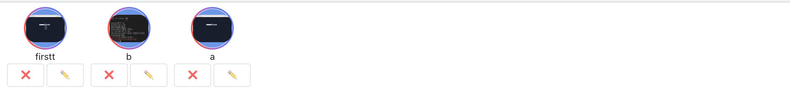

# instagram-project
Instagram Clone created with ReactJS , Typescript and Firebase.

# Note
We will continue to add more features to the project.

# Features
* Custom photo feed 
* Login feature
    * Sign Up 
        * Register you user account
    * Login 
        * Login if the user data is Registered
    * Login with Email
        * Login using your Gmail(or any existing mail account)
* Post photo posts from camera or gallery
    * Like posts
        * View all likes on a post
    * Comment on posts
        * View all comments on a post
    * Delete a post
        * Delete a post posted by User
* Profile Screen
    * View posts that a particular user has posted 
* Story Upload
    * Any User can Create/View/Update/Delete a Story
* Story Section
    * View all the Stories uploaded
* Dark/Light Mode 
* LogOut
    * Log the user out


## Getting started

1. Setup React(https://reactjs.org/) with typescript

2. Clone the repo
$ git clone https://git.geekyants.com/instagram-group/instagram-project.git
$ cd instagram-project/

3. Setup the firebase app
1. You'll need to create a Firebase instance. Follow the instructions at https://console.firebase.google.com.
2. Once your Firebase instance is created, you'll need to enable anonymous authentication.
* Go to the Firebase Console for your new instance.
* Click "Authentication" in the left-hand menu
* Click the "sign-in method" tab
* Click "Google" and enable it

4. Enable the Firebase Database
* Go to the Firebase Console
* Click "Database" in the left-hand menu
* Click the Cloudstore "Create Database" button
* Select "Start in test mode" and "Enable"

5. Enable the write permission in rules section 


## Add your files

- [ ] [Create](https://docs.gitlab.com/ee/user/project/repository/web_editor.html#create-a-file) or [upload](https://docs.gitlab.com/ee/user/project/repository/web_editor.html#upload-a-file) files
- [ ] [Add files using the command line](https://docs.gitlab.com/ee/gitlab-basics/add-file.html#add-a-file-using-the-command-line) or push an existing Git repository with the following command:

```
cd existing_repo
git remote add origin https://git.geekyants.com/instagram-group/instagram-project.git
git branch -M main
git push -uf origin main
```


## Screenshots





# Double check install instructions 
* Firestore Plugin
    * https://firebase.google.com/docs/web/setup


## Dependencies

* styled-components
* redux 
* tailwindcss
* typescript
* react-fontawesome
* material-ui
* firebase-auth
* react-insta-stories
* semantic-ui-react


## Installation

https://react.semantic-ui.com/usage/
https://www.npmjs.com/package/@firebase/auth
https://babeljs.io/docs/en/babel-preset-env
https://www.npmjs.com/package/@types/react-redux
https://www.npmjs.com/package/material-icons
https://tailwindcss.com/docs/installation


## Contributing
# How to Contribute
1. Fork the the project
2. Create your feature branch (git checkout -b my-new-feature)
3. Make required changes and commit (git commit -am 'Add some feature')
4. Push to the branch (git push origin my-new-feature)
5. Create new Pull Request


=======
# Getting Started with Create React App

This project was bootstrapped with [Create React App](https://github.com/facebook/create-react-app).

## Available Scripts

In the project directory, you can run:

### `npm start`

Runs the app in the development mode.\
Open [http://localhost:3000](http://localhost:3000) to view it in the browser.

The page will reload if you make edits.\
You will also see any lint errors in the console.

### `npm test`

Launches the test runner in the interactive watch mode.\
See the section about [running tests](https://facebook.github.io/create-react-app/docs/running-tests) for more information.

### `npm run build`

Builds the app for production to the `build` folder.\
It correctly bundles React in production mode and optimizes the build for the best performance.

The build is minified and the filenames include the hashes.\
Your app is ready to be deployed!

See the section about [deployment](https://facebook.github.io/create-react-app/docs/deployment) for more information.

### `npm run eject`

**Note: this is a one-way operation. Once you `eject`, you can’t go back!**

If you aren’t satisfied with the build tool and configuration choices, you can `eject` at any time. This command will remove the single build dependency from your project.

Instead, it will copy all the configuration files and the transitive dependencies (webpack, Babel, ESLint, etc) right into your project so you have full control over them. All of the commands except `eject` will still work, but they will point to the copied scripts so you can tweak them. At this point you’re on your own.

You don’t have to ever use `eject`. The curated feature set is suitable for small and middle deployments, and you shouldn’t feel obligated to use this feature. However we understand that this tool wouldn’t be useful if you couldn’t customize it when you are ready for it.

## Learn More

You can learn more in the [Create React App documentation](https://facebook.github.io/create-react-app/docs/getting-started).

To learn React, check out the [React documentation](https://reactjs.org/).
>>>>>>> master
